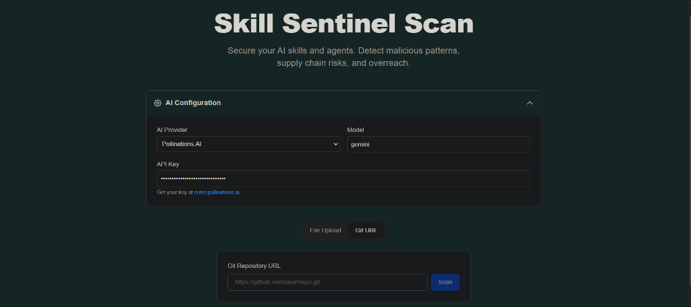
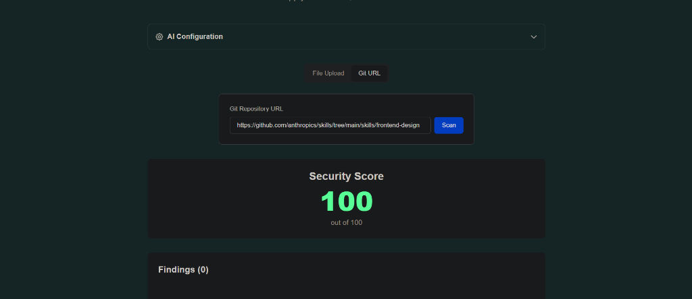

# Skill Sentinel Scan

**Secure your AI Skills and Agents.**

Skill Sentinel Scan is a Dockerized security scanner designed to detect malicious patterns, supply chain risks, and permission overreach in AI skills and agents. It provides a modern web interface for scanning code files or Git repositories and offers AI-powered remediation to fix detected issues.

## 🚀 Features

- **Multi-Source Scanning**:
  - 📂 **File Upload**: Scan `.zip`, `.py`, `.js`, and other code files directly.
  - 🔗 **Git URL**: Scan public Git repositories (including subdirectories/specific branches).
  
- **Comprehensive Security Checks**:
  - 🛡️ **Static Analysis**: Uses `bandit`, `semgrep`, and `detect-secrets` to find vulnerabilities.
  - 📦 **Supply Chain Analysis**: Detects risky dependencies and unofficial package registries.
  - 📝 **Instruction Consistency**: Checks for discrepancies between code behavior and documentation (README).
  - 🏜️ **Dynamic Analysis**: Runs code in ephemeral, sandboxed Docker containers to detect runtime threats.

- **🤖 AI Remediation**:
  - Automatically generate secure code fixes for detected vulnerabilities.
  - **Supported Providers**:
    - **OpenAI** (GPT-3.5/4)
    - **Google AI Studio** (Gemini Pro)
    - **[Pollinations.AI](https://pollinations.ai)** (Requires API Key from [enter.pollinations.ai](https://enter.pollinations.ai))
    - **OpenRouter**

## 🛠️ Architecture

- **Frontend**: React (Next.js 14), Tailwind CSS, TypeScript.
- **Backend**: Python (FastAPI), Docker SDK.
- **Orchestration**: Docker Compose.

## 🏁 Quick Start

### Prerequisites
- [Docker Desktop](https://www.docker.com/products/docker-desktop) (running).
- [Git](https://git-scm.com/downloads).

### Installation

1.  **Clone the repository:**
    ```bash
    git clone https://github.com/Amine-SGM/Skills-Sentinel.git
    cd Skills-Sentinel
    ```

2.  **Start the services:**
    ```bash
    docker-compose up --build
    ```

3.  **Access the Dashboard:**
    Open [http://localhost:3000](http://localhost:3000) in your browser.

## 📖 Usage Guides

### URL Scanning
1. Toggle the input mode to **Git URL**.
2. Paste a GitHub repository URL (e.g., `https://github.com/owner/repo`).
3. Supports subdirectories (e.g., `.../tree/main/subdir`) - the scanner will automatically clone the repo and target the specific folder.

### AI Remediation
1. Run a scan.
2. If **High**, **Medium**, or **Error** severity issues are found, the **Remediation Panel** will appear below the results.
3. Select your preferred AI Provider (e.g., *[Pollinations.AI](https://pollinations.ai)*).
4. Enter an API Key (if required) and Model name.
5. Click **Generate Secure Code** to get a fixed version of your code.

##  Screenshots

### AI Configuration & Remediation


### Scan Results


## 🔧 Development

- **Scanner**: Located in `scanner/`. Run locally with `uvicorn main:app --reload` (requires local pip dependencies).
- **Frontend**: Located in `frontend/`. Run locally with `npm run dev` (requires Node.js).

## ⚠️ Disclaimer
This tool is for educational and defensive security purposes only. Ensure you have permission to scan any code or repositories you do not own.
